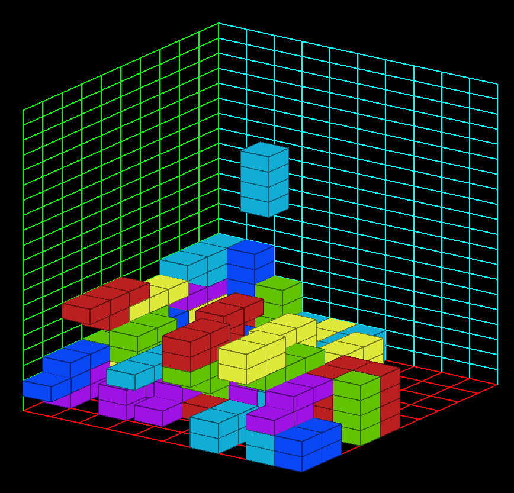

# Tetris 3D - OpenGL

Tetris 3D est une implémentation moderne et immersive du jeu classique Tetris en utilisant la bibliothèque graphique OpenGL. Profitez de la stratégie de Tetris dans un environnement tridimensionnel avec des contrôles fluides et un gameplay captivant.

---

## Aperçu
  


---

## Fonctionnalités principales
- Jeu Tetris complet avec des pièces classiques adaptées à la 3D.
- Rotations autour des axes X, Y et Z.
- Matrice de jeu tridimensionnelle dynamique.
- Contrôles via clavier et souris.
- Affichage graphique performant avec OpenGL.

---

## Installation

### **Prérequis**
Assurez-vous d'avoir les outils suivants installés sur votre système :
- Un compilateur C++ (comme GCC ou MSVC).
- La bibliothèque OpenGL.
- La bibliothèque GLUT (ou FreeGLUT).

### **Instructions**
2. Installez les dependecies :
   ```bash
   sudo apt-get install build-essential freeglut3 
   ```

2. Clonez le dépôt :
   ```bash
   git clone https://github.com/Malek9876/Tetris_Game_Project_IN204
   cd Tetris_Game_Project_IN204
   ```
3. Compilez le projet (avec g++ par exemple) :
   ```bash
   make
   ```
4. Lancez le jeu :
   ```bash
   ./TETRIS_3D
   ```

---

## Comment jouer

### **Contrôles clavier**
- **P** : Mettre en pause / Reprendre le jeu.
- **A/D** : Déplacer la pièce à gauche / à droite.
- **W/S** : Déplacer la pièce vers l’avant / l’arrière.
- **Q** : Descendre la pièce plus rapidement.
- **E/R/F** : Tourner la pièce autour des axes X, Y et Z.

### **Souris**
- **Clic gauche + Mouvement** : Rotation de la caméra.
- **Clic droit + Mouvement** : Panoramique.
- **Molette** : Zoom avant / arrière.

---

## Problèmes connus
- Certaines rotations peuvent provoquer des collisions incorrectes.
- L’optimisation graphique peut être améliorée pour des matrices plus grandes.

---

## Améliorations futures
- Implémentation d’un système de score.
- Ajout d'un mode multijoueur en ligne.
- Création d’une IA pour simuler un adversaire.

---

## Contributeurs
- Malek BelKahla
- Elyes Bouaziz


---


Merci d'avoir joué à Tetris 3D !

